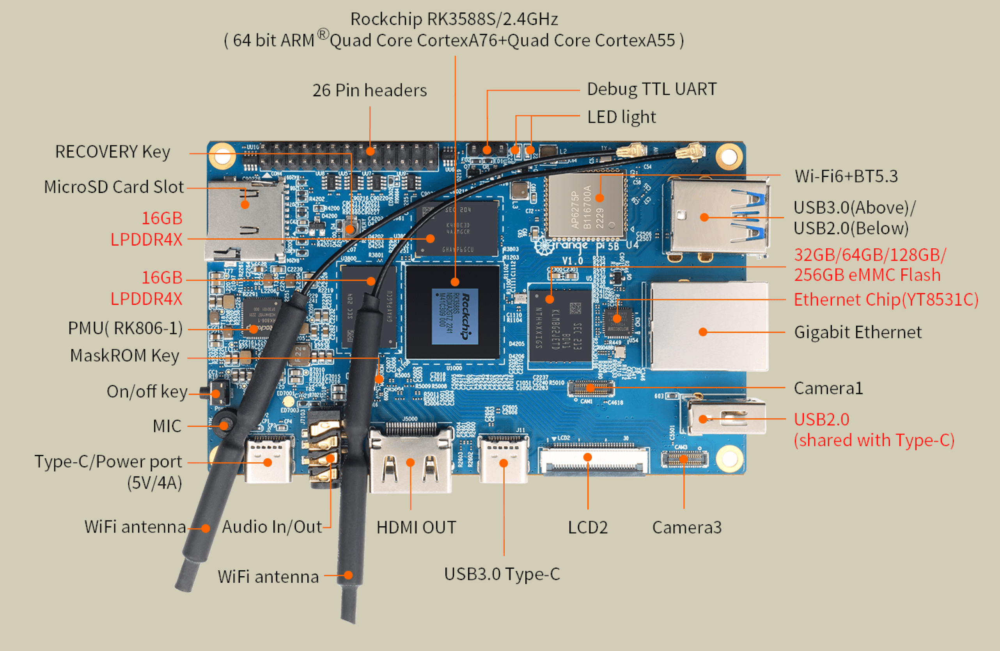

# Orange Pi 5B — Guide

<p align="center">
  
</p>

*[Lire en français](README.fr.md)*

Configuration notes for my Orange Pi 5B: choice of OS (Ubuntu
Server 24.04), installation, SSH/system hardening, eMMC preservation
(logs in RAM, vendor kernel freeze), firewall, and deployment of
systemd services (Discord bots in particular).

Written for my own use, but reusable as-is or as a base to adapt
to your own setup — replace the values between `<...>` with your own.

SSH port used as an example throughout this guide: **32412** (adjust to your setup).

## Table of Contents

0. [Initial Installation](#0-initial-installation)
1. [First System Settings](#1-first-system-settings)
2. [Updating and Freezing Packages](#2-updating-and-freezing-packages)
3. [Firewall (UFW)](#3-firewall-ufw)
4. [Hardening & eMMC Preservation](#4-hardening--emmc-preservation)
5. [Useful Commands](#5-useful-commands)
6. [Installing Tools](#6-installing-tools)
7. [Deploying a systemd Service](#7-deploying-a-systemd-service)

---

## 0. Initial Installation

### Flashing the image onto the Orange Pi 5B

Video tutorial: [Flashing the image onto the Orange Pi 5B (Maskrom mode)](https://youtu.be/5q_tytwmseg)

Tools needed for flashing, to be used while following the video
above: [RKDevTool-DriverAssitant-MiniLoader.zip](RKDevTool-DriverAssitant-MiniLoader.zip)

Image to flash — Ubuntu Server 24.04 preinstalled for the Orange Pi 5B, from
[Joshua Riek's ubuntu-rockchip project](https://github.com/Joshua-Riek/ubuntu-rockchip):
[ubuntu-24.04-preinstalled-server-arm64-orangepi-5b.img.xz](https://github.com/Joshua-Riek/ubuntu-rockchip/releases/download/v2.4.0/ubuntu-24.04-preinstalled-server-arm64-orangepi-5b.img.xz)

### SSH Access

#### Generate a key (Windows side)

```powershell
ssh-keygen -t ed25519 -f %userprofile%\.ssh\sbc1 -C "orangepi5b"
```

#### Send the public key to the server

The **private** key never leaves Windows (`%USERPROFILE%\.ssh\sbc1`).

```powershell
type "%USERPROFILE%\.ssh\sbc1.pub" | ssh <USER>@<IP_SERVER> "mkdir -p ~/.ssh && cat >> ~/.ssh/authorized_keys && chmod 700 ~/.ssh && chmod 600 ~/.ssh/authorized_keys"
```

#### Test

```powershell
ssh -i %USERPROFILE%\.ssh\sbc1 <USER>@<IP_SERVER>
```

#### Harden the SSH configuration

```bash
sudo nano /etc/ssh/sshd_config
```

Content to adapt/paste (`Ctrl+O` then `Enter` to save, `Ctrl+X` to quit):

```ini
Port 32412
LoginGraceTime 30s
PermitRootLogin no
MaxAuthTries 3
PubkeyAuthentication yes
AuthorizedKeysFile .ssh/authorized_keys
PasswordAuthentication no
KbdInteractiveAuthentication no
UsePAM yes
X11Forwarding no
AllowUsers <USER>   # if there's only one user on the machine
```

```bash
sudo systemctl restart ssh
```

#### SSH config on the Windows side (`%USERPROFILE%\.ssh\config`)

Used both as a shortcut for `ssh <ALIAS>` and for VSCode Remote-SSH:

```
Host <ALIAS>
    HostName <IP_SERVER>
    User <USER>
    Port 32412
    IdentityFile ~/.ssh/sbc1
```

#### Check intrusion attempts

No `/var/log/auth.log` on this machine (rsyslog disabled, see
[section 4](#4-hardening--emmc-preservation); journald set to
`ForwardToSyslog=no` — see [99-journald-emmc.conf](99-journald-emmc.conf)):
use `journalctl` instead.

```bash
sudo journalctl -u ssh -g "Invalid user"
```

⚠️ If `Storage=volatile` (the choice made in this guide), it only covers the
current boot — no history after a reboot.

### Change the username (and the hostname)

`usermod -l` refuses to rename a user who is currently logged in or has
active processes — it's simpler to create a new account, migrate, then
delete the old one.

```bash
sudo adduser <NEW>
sudo usermod -aG sudo <NEW>                  # sudo privileges
sudo usermod -aG systemd-journal <NEW>       # read journalctl without sudo
sudo hostnamectl set-hostname <NEW_HOSTNAME> # machine's name on the network (visible in the prompt, mDNS, etc.)
```

⚠️ **Before deleting the old account**, migrate its contents — the
`userdel -r` command (used further below) deletes `/home/<OLD>` entirely,
bots included:

```bash
sudo rsync -aAX /home/<OLD>/ /home/<NEW>/
sudo chown -R <NEW>:<NEW> /home/<NEW>
```

(this includes `~/.ssh/authorized_keys` — your SSH key follows automatically)

Update the files that hardcode the old name before switching over:
- `User=`/`WorkingDirectory=` in your `.service` files (see
  [discord-bot.service](discord-bot.service)) → `daemon-reload` + `restart` once fixed
- `AllowUsers` in `/etc/ssh/sshd_config` (see SSH Access above) — forget this,
  and the new account gets locked out of SSH even with the right key

Switch over and clean up:

```bash
exit
ssh <NEW>@<IP_SERVER>
sudo pkill -u <OLD>
sudo userdel -r <OLD>
ls /home   # check
```

### Files to copy into the Orange Pi 5B's `$HOME`

With the account renamed and SSH secured (key + port 32412, steps above):
now copy these files from the repo into the user's `$HOME` on the
Orange Pi 5B (`git clone`, `scp`, or manual copy-paste):

- [.bashrc](.bashrc)
- [99-hardening.conf](99-hardening.conf)
- [99-journald-emmc.conf](99-journald-emmc.conf)
- [orangepi5b-kernel-freeze.sh](orangepi5b-kernel-freeze.sh)
- [systemd-journald-override.conf](systemd-journald-override.conf)
- [ufw-setup.sh](ufw-setup.sh)

---

## 1. First System Settings

### Automatic login (console — pointless in practice without a screen/keyboard)

```bash
sudo mkdir -p /etc/systemd/system/getty@tty1.service.d
sudo nano /etc/systemd/system/getty@tty1.service.d/override.conf
```

Content to paste (`Ctrl+O` then `Enter` to save, `Ctrl+X` to quit):

```ini
[Service]
ExecStart=
ExecStart=-/sbin/agetty --autologin <USER> --noclear --noissue %I $TERM
```

```bash
sudo systemctl daemon-reload
```

### Time zone and 24h format (France)

```bash
sudo timedatectl set-timezone Europe/Paris
sudo localectl set-locale LC_TIME="fr_FR.UTF-8"   # 24h format (en_US.UTF-8 would give 12h AM/PM)
```

Log out/back in for the format change to take effect.

### Disable WiFi and Bluetooth (board on wired Ethernet)

```bash
rfkill list                   # current state of the radios
sudo rfkill block wifi
sudo rfkill block bluetooth
```

Automatically persists across reboots (`systemd-rfkill` saves the state).
To fully shut down the Bluetooth daemon:

```bash
sudo systemctl disable --now bluetooth.service
```

### `Wait for Network to be Configured` failing at boot (flaky connection)

On a connection that isn't always stable, `systemd-networkd-wait-online.service`
can fail at boot (`Failed to start Wait for Network to be Configured`) — it
waits for a clean connection up to the default timeout (120s) before giving up.

```bash
sudo systemctl edit --full systemd-networkd-wait-online.service
```

On the `ExecStart=` line, add `--timeout=10` (shortens the wait to 10s):

```ini
ExecStart=/lib/systemd/systemd-networkd-wait-online --timeout=10
```

```bash
sudo systemctl daemon-reload
```

### Unnecessary services on the Orange Pi 5B

```bash
sudo systemctl disable --now apport         # Ubuntu crash reports
sudo systemctl mask apport

sudo systemctl disable --now ModemManager   # no cellular modem on this board

sudo systemctl disable --now multipathd     # no multipath storage (SAN/iSCSI)
sudo systemctl mask multipathd multipathd.socket

sudo systemctl disable --now plymouth-quit-wait plymouth-quit plymouth-read-write # graphical boot screen, useless headless
```

⚠️ `lvm2-monitor` and `blk-availability` (same family, device-mapper) only if
the board isn't using LVM — check first with `lsblk` (no volume group shown
= good):

```bash
sudo systemctl disable --now lvm2-monitor blk-availability
```

`cloud-init` is only used for configuration on the very first boot — safe to
disable once the board is already configured (which is the case at this
point in the guide):

```bash
sudo touch /etc/cloud/cloud-init.disabled
sudo systemctl disable --now cloud-init \
  cloud-config \
  cloud-final \
  cloud-init-local
```

### Purge snapd (optional)

If you don't use any snap packages: `apt purge` removes the package entirely
(binaries, data in `/var/lib/snapd`/`/var/cache/snapd`), which also removes
all its services along the way (`snapd.service`, `snapd.socket`,
`snapd.apparmor.service`...) — no need to disable them one by one beforehand.

```bash
sudo systemctl disable --now snapd.socket snapd.service snapd.apparmor.service
sudo apt purge -y snapd
sudo rm -rf /var/cache/snapd /var/lib/snapd ~/snap
sudo apt-mark hold snapd # prevents a future snapd-dependent package from reinstalling it on its own
```

---

## 2. Updating and Freezing Packages

⚠️ On a freshly installed board, **freeze the Rockchip vendor kernel first**
before any `apt upgrade` — a generic upgrade can replace it with a standard
kernel lacking the Rockchip drivers (eMMC/NVMe/GPU) and prevent it from
booting. Ready-to-use script:
[orangepi5b-kernel-freeze.sh](orangepi5b-kernel-freeze.sh).

### Freeze the packages manually

```bash
uname -r                # kernel actually running, e.g.: 6.1.0-1025-rockchip
dpkg -l | grep -i linux # find the packages containing this version
```

Two categories to freeze, both matter (adapt the names to your version):

```bash
# Versioned packages (contain the number found with uname -r)
sudo apt-mark hold linux-image-6.1.0-1025-rockchip linux-headers-6.1.0-1025-rockchip \
  linux-modules-6.1.0-1025-rockchip linux-modules-extra-6.1.0-1025-rockchip \
  linux-rockchip-headers-6.1.0-1025

# Meta-packages WITHOUT a version number (easy to forget, they're the ones
# that can pull in a new version on the next upgrade)
sudo apt-mark hold linux-rockchip linux-headers-rockchip linux-image-rockchip linux-firmware
```

```bash
apt-mark showhold   # check that everything's there
```

### Unfreeze

```bash
sudo apt-mark unhold <PACKAGE>              # one specific package
sudo apt-mark unhold $(apt-mark showhold)  # unfreeze everything at once
```

### Update everything else without touching the frozen kernel

```bash
sudo apt update && sudo apt upgrade
sudo apt autoremove --dry-run # ⚠️ ALWAYS dry-run first
sudo apt autoremove           # only if no kernel/firmware package appears in the dry run
```

`apt-mark hold` protects against upgrades, but some past versions of apt
have offered to remove a frozen package that became an "orphan" during an
autoremove — hence the systematic `--dry-run`.

⚠️ This freeze isn't forever: it also blocks the kernel's security patches.
Recheck every 3-6 months whether a newer image exists, then unfreeze →
targeted upgrade → refreeze.

---

## 3. Firewall (UFW)

See [ufw-setup.sh](ufw-setup.sh) for the complete configuration
(reproducible, with an anti-lockout safety net). Quick check:

```bash
sudo ufw status verbose
```

Port 80 in `EXTRA_LAN_TCP_PORTS=(80)` corresponds to the AdGuard Home web
interface (see section 6). Verified with `sudo ss -tulpn`: port 3000
(initial setup wizard) is no longer listening, only port 80 is — the admin
interface has therefore been switched over to that port.

### Block an IP address

```bash
sudo ufw deny from <IP>          # blocks all incoming connections from this IP
sudo ufw insert 1 deny from <IP> # same rule, but takes priority over the ones already in place
```

Check / remove afterwards:

```bash
sudo ufw status numbered # shows the rules with a number
sudo ufw delete <NUMBER> # deletes the matching rule
```

---

## 4. Hardening & eMMC Preservation

Files involved: [99-hardening.conf](99-hardening.conf) (sysctl),
[99-journald-emmc.conf](99-journald-emmc.conf) +
[systemd-journald-override.conf](systemd-journald-override.conf) (logs),
`/etc/fstab` (RAM-backed folders, see below).

`cp` directly overwrites the old file at the same path — to update a config
that's already installed, no need to delete it first, just copy it over
again and reload the relevant service:

```bash
sudo cp 99-hardening.conf /etc/sysctl.d/99-hardening.conf && sudo sysctl --system
sudo mkdir -p /etc/systemd/journald.conf.d
sudo cp 99-journald-emmc.conf /etc/systemd/journald.conf.d/99-journald-emmc.conf
sudo rm -f /etc/systemd/journald.conf
sudo systemctl restart systemd-journald
```

`/etc/sysctl.d/` already exists by default on Ubuntu, but `/etc/systemd/journald.conf.d/` has to be created the first time (`mkdir -p` doesn't complain if it already exists, so it's safe to rerun later).

⚠️ The `rm` on `/etc/systemd/journald.conf` is intentional: if you (or a previous install) had already hardcoded values into that file, they would coexist with the drop-in and make verification confusing (even though the drop-in always wins in case of conflict). Deleting it guarantees that `99-journald-emmc.conf` is the sole source of configuration — journald falls back to its defaults for everything else, without losing anything important.

Why `/etc/systemd/journald.conf.d/` instead of directly editing
`/etc/systemd/journald.conf` (the "classic" way, `sudo nano
/etc/systemd/journald.conf`): a `.d/` folder is something we created
ourselves, never managed by a package — a systemd `apt upgrade` will never
ask "this file was modified locally, keep/replace?" the way it can on the
main file. Same logic as `/etc/sysctl.d/` for `99-hardening.conf`.

Check what's actually active (merge of the main file + drop-ins):

```bash
systemd-analyze cat-config systemd/journald.conf
```

Concretely verify that the journal is indeed running in RAM (`Storage=volatile`) and not on the eMMC:

```bash
journalctl --header | grep -i "file path"
```

The path shown should be under `/run/log/journal/...` (tmpfs, RAM) — if you see `/var/log/journal/...`, it's not active.

### Disable rsyslog (duplicate of journald)

Ubuntu Server installs `rsyslog` by default — if it's still running, it
writes its own text logs to the eMMC in parallel (`/var/log/syslog`,
`/var/log/auth.log`...), which defeats the purpose of the RAM-backed
journal configured above. Check: `systemctl status rsyslog`. Remove it:

```bash
sudo systemctl disable --now rsyslog
sudo apt purge -y rsyslog
```

### journald's CPU/I/O priority versus the bots

`99-journald-emmc.conf` controls WHAT journald keeps. What follows controls
the execution priority OF THE journald PROCESS itself — two different
mechanisms (one read by journald, the other by systemd PID 1), hence two
files in two different locations, impossible to merge them.

```bash
sudo mkdir -p /etc/systemd/system/systemd-journald.service.d
sudo cp systemd-journald-override.conf /etc/systemd/system/systemd-journald.service.d/override.conf
sudo systemctl daemon-reload
sudo systemctl restart systemd-journald
```

Check: `systemctl show systemd-journald --property=Nice,IOSchedulingClass,CPUWeight`

### AdGuard Home (query log / statistics)

Blind spot relative to everything above: AdGuard Home (see section 6)
writes its own DNS query log and statistics to the eMMC, in
`/opt/AdGuardHome/data/`, independently of journald/rsyslog. This is
configured in the web interface, not in a config file:

**Settings** → **General Settings** → uncheck *Enable log* and *Enable
statistics* (or at least reduce their retention period), then **Save**.

### `/etc/fstab`

`/etc/fstab` is an exception: unlike the previous files, it has no `.d/`
folder — lines are added/replaced directly inside it, no drop-in.

⚠️ Back it up before touching the file — a syntax error in `/etc/fstab`
can prevent a clean boot:

```bash
sudo cp /etc/fstab /etc/fstab.bak
sudo nano /etc/fstab
```

On the existing line for the root partition (`/`), add
`,commit=60,x-systemd.growfs` at the end of the options already present
(4th column) — no need to look up the UUID, you're not touching the rest of
the line. `commit=60` spaces out the ext4 journal commits (to coordinate
with `dirty_writeback` in `99-hardening.conf`); `x-systemd.growfs` grows
the partition at boot if needed.

Then add the `tmpfs` lines at the end of the file, without touching the
other existing lines (boot, swap):

```
tmpfs /tmp              tmpfs rw,nosuid,nodev,noexec,noatime,mode=1777,size=512M 0 0  # noexec: breaks npm install if there's a native dependency (node-gyp)
tmpfs /var/tmp          tmpfs rw,nosuid,nodev,noatime,mode=1777,size=128M 0 0         # unlike /tmp, no longer survives reboot once on tmpfs
tmpfs /var/cache/apt    tmpfs rw,noatime,mode=0755,size=1G 0 0                        # deliberately large, avoids an ENOSPC mid apt upgrade
tmpfs /var/log          tmpfs rw,nosuid,nodev,noatime,mode=0755,size=100M 0 0         # wtmp/btmp/lastlog reset to zero on every reboot
tmpfs /var/spool        tmpfs rw,nosuid,nodev,noatime,mode=0755,size=50M 0 0          # ⚠️ wipes user crontabs (crontab -e) on every reboot

# tmpfs /var/lib/fail2ban tmpfs rw,noatime,mode=0755,size=32M 0 0   # if fail2ban is installed: configure its jails with backend=systemd (no rsyslog here)
```

Save (`Ctrl+O` then `Enter`), quit (`Ctrl+X`), then apply without rebooting
to verify that fstab is read correctly:

```bash
sudo systemctl daemon-reload
sudo mount -a
findmnt -t tmpfs   # confirms the mount points are indeed active
```

---

## 5. Useful Commands

### nano (text editor, the bare minimum)

| Shortcut | Action |
|---|---|
| `Ctrl+O` then `Enter` | Save without quitting |
| `Ctrl+X` | Quit (asks `Y`/`N` if there are unsaved changes, then `Enter` to confirm the file name) |

### Processes

```bash
ps -e         # lists all processes
kill <PID>    # terminates a process (SIGTERM, clean)
kill -9 <PID> # forced (SIGKILL, last resort)
htop          # interactive CPU/RAM view per process
```

### System & network — quick diagnostics

| Command | Purpose |
|---|---|
| `ip a` (or `ifconfig`) | Network addresses and interfaces |
| `iwconfig` | WiFi info |
| `hostname -I` | Shows only the machine's IP |
| `hcitool dev` | Bluetooth status |
| `lsusb` | Connected USB devices |
| `dmesg` | Kernel logs (boot, hardware) |
| `dmesg \| sed '/eth.*Link is/h;${x;p};d'` | Ethernet cable quality |
| `dmesg \| grep -i Voltage` | Power supply quality |
| `free -h` | Available/used RAM |
| `sensors` | Component temperatures |
| `lsb_release -a` | Installed Ubuntu version |

### Miscellaneous

```bash
clear  # clears the terminal
reboot # sudo reboot
exit   # closes the session
```

---

## 6. Installing Tools

Nothing here is mandatory — install only what you need.

### Node.js (via `n`, recommended method — not apt's `nodejs` packages)

`n` installs itself via npm — so you need a bootstrap npm before you can
use it (it will then be replaced by the version `n` installs):

```bash
sudo apt install nodejs npm
sudo npm install -g n
sudo n latest
```

Remove an old Node.js installed via apt (avoids path conflicts):

```bash
sudo apt-get purge nodejs*
sudo rm -rf /var/lib/apt/lists/*
sudo rm -rf /etc/apt/sources.list.d/*
sudo apt-get update
```

Confirm that `node` correctly points to `n`'s install (`/usr/local/bin/node`
— this is exactly the path hardcoded in `ExecStart=` of
[discord-bot.service](discord-bot.service)):

```bash
which node
node -v
```

Useful npm/Node commands:

```bash
sudo n latest                                           # update Node.js
sudo npm install -g npm@latest                          # update npm itself
sudo npm update -g                                      # update global npm packages
sudo npm cache clean --force                            # clear the npm cache
npm cache verify                  
npm view <PACKAGE> version                               # latest published version of a package
npm list <PACKAGE>                                       # locally installed version
sudo rm -rf node_modules package.json package-lock.json # reset a project's dependencies
npm pkg set type=module                                 # enables ESM syntax (import/export) instead of require/module.exports
```

### Java (JDK, manual install — ARM64)

Find the current version: [oracle.com/java/technologies/downloads](https://www.oracle.com/java/technologies/downloads/)
→ note the major version number shown (e.g. 26), Linux section →
"ARM 64 Compressed Archive" button (right-click → copy link to verify the
exact URL).

The link always follows this format, where only the major version number
changes — no need to know the exact build number, `latest` in the URL
takes care of that automatically:

```
https://download.oracle.com/java/<VERSION>/latest/jdk-<VERSION>_linux-aarch64_bin.tar.gz
```

```bash
wget https://download.oracle.com/java/<VERSION>/latest/jdk-<VERSION>_linux-aarch64_bin.tar.gz
sudo mkdir -p /usr/lib/jvm
sudo tar -zxf jdk-*_linux-aarch64_bin.tar.gz -C /usr/lib/jvm
sudo mv /usr/lib/jvm/jdk-<VERSION>.* /usr/lib/jvm/jdk-<VERSION>

sudo update-alternatives --install /usr/bin/java java /usr/lib/jvm/jdk-<VERSION>/bin/java 100
sudo update-alternatives --install /usr/bin/javac javac /usr/lib/jvm/jdk-<VERSION>/bin/javac 100
sudo update-alternatives --config java
sudo update-alternatives --config javac

java --version
javac --version
```

Uninstall:

```bash
sudo rm -R /usr/lib/jvm/jdk-<VERSION>
sudo rm -f /etc/profile.d/jdk.sh /etc/profile.d/jdk.csh
```

### Minecraft Server (PaperMC)

Requires the JDK installed above. Download the latest stable build:
[papermc.io/downloads/paper](https://papermc.io/downloads/paper)

Direct launch (keeps the terminal open):

```bash
java -Xmx<RAM_MB>M -Xms<RAM_MB>M -jar paper.jar nogui
```

`-Xmx`/`-Xms` set the RAM allocated to the JVM (identical to avoid hot
reallocations) — leave headroom for the OS and other services (AdGuard
Home, bots...) rather than giving everything to the server.

#### Keep the server running without a dedicated terminal (SSH without VSCode)

```bash
sudo apt install screen
screen -S paper
java -Xmx<RAM_MB>M -Xms<RAM_MB>M -jar paper.jar nogui
```

`Ctrl+A` then `D` detaches the session without stopping the server,
`screen -r` reopens it.

For automatic startup at boot (and restart on crash) instead of a `screen`
session you'd have to relaunch by hand after a reboot, reuse the
[discord-bot.service](discord-bot.service) template from section 7: adapt
`ExecStart` to the `java` command above, `WorkingDirectory` to the server's
folder, remove the Node.js-specific `Environment=` lines, raise
`MemoryMax` beyond `-Xmx` (headroom outside the JVM heap), and increase
`TimeoutStopSec` (the world needs time to save on shutdown).

#### Open the port to players

Default port: `25565/tcp` — add it to `EXTRA_LAN_TCP_PORTS` in
[ufw-setup.sh](ufw-setup.sh) (section 3), otherwise the server runs but
nobody can connect to it from the rest of the network.

#### First launch and configuration

The first startup creates all the server's folders/files. A few useful
settings afterward, in the server console:

```
whitelist on
whitelist add <PLAYER>
op <ADMIN>
gamerule mobGriefing false   # creatures can no longer modify the terrain
gamerule doFireTick false    # fire no longer spreads
```

#### Plugins

Drop the plugin's `.jar` into the `plugins/` folder then restart the
server. A few useful commands for the WorldGuard plugin:

```
rg flag -w world __global__ greeting-title
rg flag -w world __global__ block-break deny
rg flag -w world __global__ tnt deny
rg flag -w world __global__ other-explosion deny
```

### AdGuard Home

```bash
sudo curl -s -S -L https://raw.githubusercontent.com/AdguardTeam/AdGuardHome/master/scripts/install.sh | sh -s -- -v
```

Then head to `http://<IP_SERVER>:3000/` (`ip a` to find the IP if needed)
→ **Get Started**. Connected via VSCode Remote-SSH (config above): the
port is auto-forwarded, `http://127.0.0.1:3000/` also works directly from
Windows.

Classic error on Ubuntu: `validating ports: listen tcp 0.0.0.0:53: bind:
address already in use` (conflict with `systemd-resolved`):

```bash
sudo nano /etc/systemd/resolved.conf
```
```ini
DNS=127.0.0.1
FallbackDNS=1.1.1.1 1.0.0.1
DNSStubListener=no
DNSSEC=no
DNSOverTLS=no
```
```bash
sudo systemctl restart systemd-resolved
```

Refresh the install page, continue, then set a username/password for the
interface. Once installation is complete, the interface switches to port
80 (see section 3) — access it afterward via `http://<IP_SERVER>/`, the
machine's real IP rather than `127.0.0.1` (the VSCode tunnel only applies
to the install wizard on port 3000); this is also the IP to use as DNS on
the rest of the network.

Remember to disable the query log and statistics (**Settings** →
**General Settings** → uncheck *Enable log* and *Enable statistics* →
**Save** — see [section 4](#4-hardening--emmc-preservation)) if you want
to preserve the eMMC: this isn't done by default.

Service control — AdGuard registers its own systemd service itself via its own binary (no need for the usual `discord-bot.service` template):

```bash
sudo /opt/AdGuardHome/AdGuardHome -s start|stop|restart|status|install|uninstall
```

If `/etc/hosts` ends up broken afterward (`sudo: unable to resolve
host`):

```bash
sudo nano /etc/hosts
```
```
127.0.0.1 localhost
127.0.1.1 <HOSTNAME>
```

If `ping` breaks at the same time:

```bash
sudo apt reinstall iputils-ping
```

Check which DNS a Windows machine is actually using:

```powershell
nslookup
```

Reinstall (e.g. to reset the admin password):

```bash
sudo curl -s -S -L https://raw.githubusercontent.com/AdguardTeam/AdGuardHome/master/scripts/install.sh | sh -s -- -r
```

### Evil Limiter (limit/block a device's bandwidth on the LAN)

⚠️ Works via ARP spoofing — needs no admin access on the other devices to
act on them. Use only on a network you administer yourself.

System dependencies:

```bash
sudo apt install iptables iproute2 python3-venv
```

Download the latest release (adjust `<VERSION>`):
[github.com/bitbrute/evillimiter/releases](https://github.com/bitbrute/evillimiter/releases)

```bash
cd evillimiter-<VERSION>
```

On Ubuntu 24.04 (Python 3.12), `sudo python3 setup.py install` generally
fails (`setuptools` missing + PEP 668 "externally-managed-environment"
protection) — install instead in a dedicated virtual environment:

```bash
python3 -m venv venv
source venv/bin/activate
pip install setuptools
python3 setup.py install
sudo venv/bin/evillimiter   # sudo required for low-level network access
```

Useful commands once launched:

```
scan
hosts
quit
```

Limiting examples:

```
block 0                      # blocks the connection of the first listed address
block all                    # blocks everyone
free all                     # releases everyone
limit 0,1 100kbit --download # limits the download rate of the first two addresses
```

`--upload`/`--download` target one direction or the other respectively;
without specifying, the limit applies to both.

```
monitor   # view the connections currently limited/blocked
```

### Fastfetch (system info)

```bash
sudo add-apt-repository ppa:zhangsongcui3371/fastfetch
sudo apt update
sudo apt install fastfetch
```

Generate a config file (customizable afterward):

```bash
fastfetch --gen-config
```

---

## 7. Deploying a systemd Service

Complete template: [discord-bot.service](discord-bot.service) — replace
`<NAME_BOT>`/`<USER>`, rename to `<name-bot>.service` (the file name =
the service name in `systemctl`, your choice).

Two ways to get the file into the right place, your choice:
- copy the repo's template then edit it in place:
  ```bash
  sudo cp discord-bot.service /etc/systemd/system/<name-bot>.service
  sudo nano /etc/systemd/system/<name-bot>.service
  ```
- or directly create/paste the content by hand at the right path, without
  going through the repo:
  ```bash
  sudo nano /etc/systemd/system/<name-bot>.service
  ```

Before enabling it, check that the file is syntactically valid (useful
after a manual edit, avoids discovering a typo only at startup):

```bash
systemd-analyze verify /etc/systemd/system/<name-bot>.service
```

```bash
sudo systemctl daemon-reload
sudo systemctl enable --now <name-bot>.service
```

### List the services

```bash
systemctl --type=service                 # all known services
systemctl --type=service --state=running # only the running ones
```

### Control a service

```bash
sudo systemctl start <name-bot>.service   # starts it now
sudo systemctl stop <name-bot>.service    # stops it now
sudo systemctl restart <name-bot>.service # restarts it
systemctl status <name-bot>.service       # status + latest log lines
sudo systemctl enable <name-bot>.service  # starts automatically on boot
sudo systemctl disable <name-bot>.service # no longer starts on boot (without stopping it now)
journalctl -u <name-bot>.service -f       # live logs
```

### Remove a service

```bash
sudo systemctl stop <name-bot>.service    # stop it first
sudo systemctl disable <name-bot>.service # remove it from automatic startup
sudo rm /etc/systemd/system/<name-bot>.service
sudo rm -rf /etc/systemd/system/<name-bot>.service.d # if an override exists (systemctl edit or manual .d folder)
sudo systemctl daemon-reload             # forgets the deleted service
sudo systemctl reset-failed              # clears any lingering "failed" state still shown
```

To manage several bots without retyping the full service name each time,
`.bashrc` (copied in [section 0](#0-initial-installation)) contains a `bot`
function that does this (`bot start <name>`, `bot status`, `bot logs`,
etc.) — see the file directly.

## License

Copyright (C) 2026 Nyaldee. Licensed under the [GNU General Public License v3.0](LICENSE) — see the `LICENSE` file for the full text.
